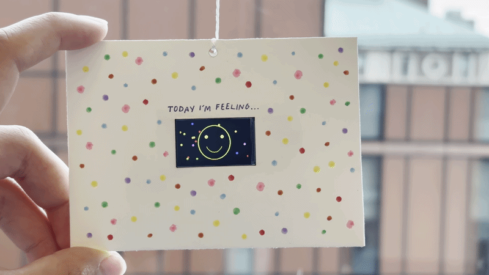
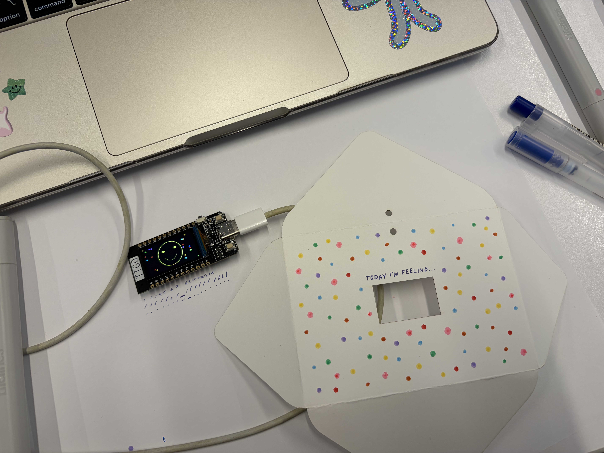
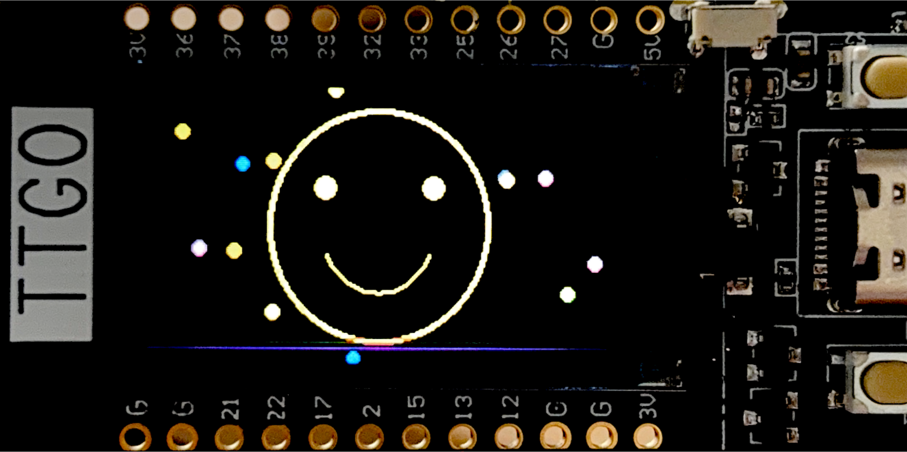
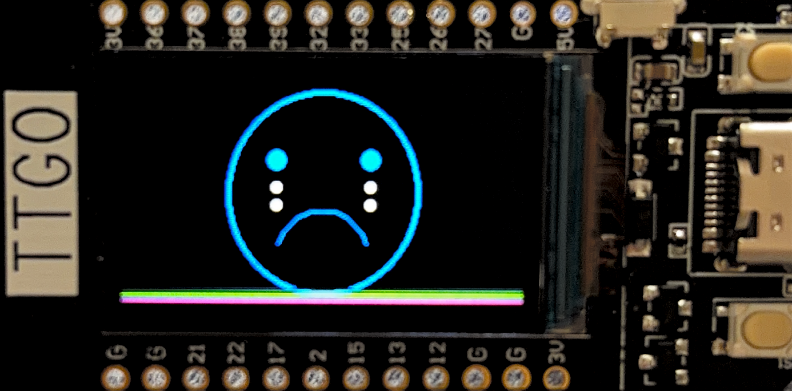

# "Today I'm Feeling..."

A generative sketch for an ESP32 + TFT display that animates a smiley face morphing through three moods: yellow and happy with confetti, pink and neutral, then blue and sad with tears.

## Artistic Vision

I wanted to create a transition of mood because I feel like our moods and reactions dictate our day-to-day experiences and our life. To move beyond simple facial expression, I added some extra elements like confetti and tears to the happy and sad faces. The confetti behind the happy face changes configuration in color and positioning every time as a small ode to the randomness and surprise that comes along with the emotion.

## Design

Over a simple black backdrop, three total faces transition from happy to neutral to sad on a continuous loop. They spend the same amount of time on screen each time they loop. The only thing that changes for each loop is the confetti behind the happy face, which I set to be random. 

## Materials

- ESP32
- TFT display
- USB-C cable
- **FOR EXHIBITION:**
- LiPo battery
- Paper envelope
- Tape
- Drawing/coloring materials for the physical decoration

## Software

- Arduino IDE
- C++
- TFT_eSPI library
- SPI library

## How to Run the Code

1. Open the Arduino sketch `module1gallery.ino`.
2. Connect the ESP32 to your computer.
3. Make sure the ESP32 board is selected in Arduino IDE.
4. Install the TFT_eSPI library if it is not already installed.
5. Upload the code to the ESP32.
6. Connect the TFT display and battery.
7. The generative animation will begin automatically.

## Installation

The TFT display is placed behind a cutout in a paper envelope so that it turns into an extension of the confetti background. Over the display, on the envelope, it reads, "Today I'm Feeling..." while the facial expressions change continuously below. The ESP32 and battery are placed behind the envelope.

## Final Design

## Installation Photos

## Code

The complete Arduino code used for the installation is included in this repository as `module1gallery.ino`.
